# LGBTIQ 공동체 깃발
> 원문을 읽고 싶으신가요? [여기](https://outrightinternational.org/insights/flags-lgbtiq-community)를 확인해보세요.

깃발은 LGBTIQ+ 운동에서 항상 중요한 부분을 차지해 왔습니다. 이 깃발들은 진보를 축하하고, 대표성을 옹호하며, 집단 행동을 요구하고 추진하는 것을 시각적으로 나타냅니다. 수년에 걸쳐 많은 LGBTIQ+ 깃발이 존재해 왔으며, 일부 깃발들은 진화했고, 다른 깃발들은 지속적으로 개념화되고 새롭게 만들어지고 있습니다.

\
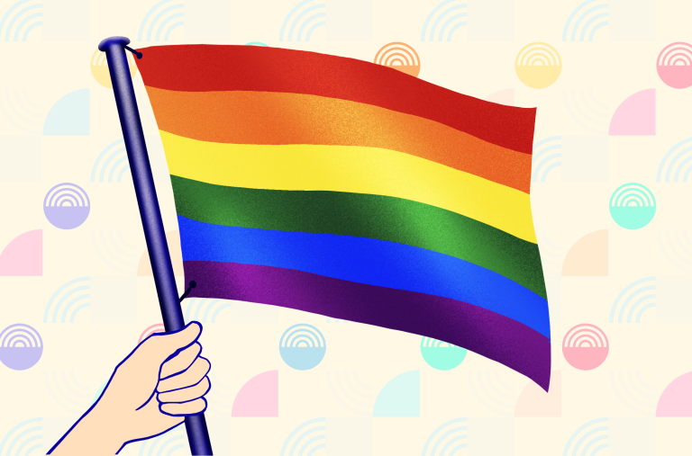

**무지개 깃발**

1978년 Gilbert Baker에 의해 만들어진 상징적인 프라이드 무지개 깃발은 원래 여덟 개의 줄무늬로 구성되어 있었습니다. 분홍색은 섹슈얼리티를, 빨간색은 치유를, 노란색은 태양을, 초록색은 자연과의 평온을, 청록색은 예술을, 남색은 조화를, 보라색은 정신을 나타냅니다. 이후 분홍색 줄무늬가 사라지고, 청록색과 남색 줄무늬가 로열 블루로 대체되어 현재는 여섯 가지 색상만 남아 있습니다.

\
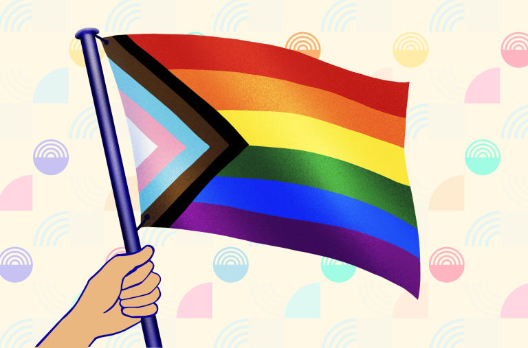

**프로그레스 프라이드 깃발**

2018년 논바이너리 예술가 Daniel Quasar에 의해 만들어진 프로그레스 프라이드 깃발은 1978년의 상징적인 무지개 깃발을 기반으로 만들어졌습니다. 이 디자인은 유색인종이면서 LGBTIQ+인 사람들을 나타내는 검정색과 갈색 줄무늬, 트랜스젠더 깃발에서 가져온 파란색, 분홍색, 흰색 줄무늬로 다양성과 포용성을 상징합니다.

\
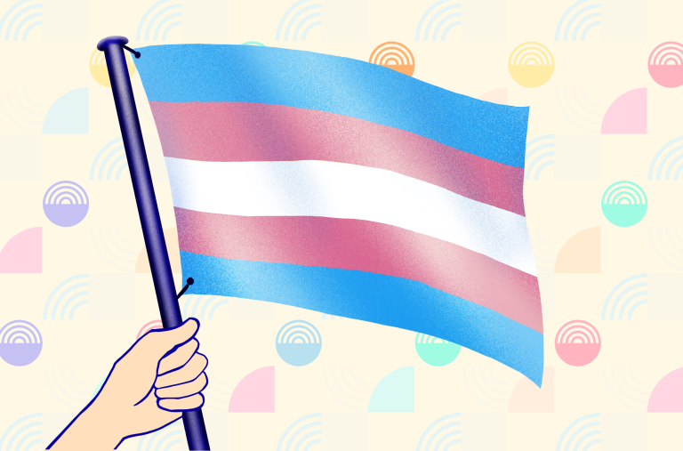

**트랜스젠더 깃발**

트랜스젠더 미국인 Monica Helms에 의해 고안된 트랜스젠더 깃발은 1999년에 처음 등장했습니다. 연한 파란색과 연한 분홍색은 각각 전통적인 여자아이와 남자아이의 색상을 상징합니다. 한편, 흰색은 간성으로 정체화하는 사람들, 젠더 중립인 사람들, 혹은 젠더 전환중인 사람들을 나타냅니다. Helms의 말에 따르면, 이 깃발은 대칭적이어서 "어떤 방향으로 날리든 항상 옳으며, 이는 트랜스젠더인 사람들이 스스로의 삶에서 올바름을 찾는 것을 의미한다"고 합니다.

\
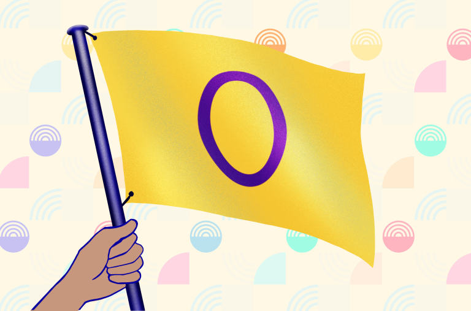

**간성 깃발**

간성인 사람들과 역사적으로 연결된 색상인 노란색과 보라색 조합을 사용한 이 깃발은 2013년 7월 Morgan Carpenter에 의해 만들어졌습니다. Carpenter의 말에 따르면 이 깃발의 색상과 상징은 “성별과 관련된 모든 것을 완전히 피하려는 의도를 가지며”, 보라색 원은 “완전함, 온전함, 그리고 간성인 사람들의 잠재력”을 상징한다고 합니다.

\
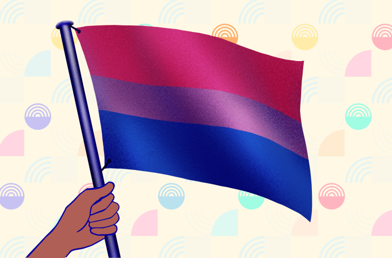

**양성애자 깃발**

1998년 Michael Page에 의해 만들어진 양성애자 깃발은 분홍색과 로열 블루, 그리고 중앙에 겹치고 있는 보라색 줄무늬를 가지고 있습니다. 분홍색은 동성에 대한 끌림을, 로열 블루는 이성에 대한 끌림을 나타내며, 보라색 줄무늬는 모든 성별에 대한 끌림을 상징합니다.

\
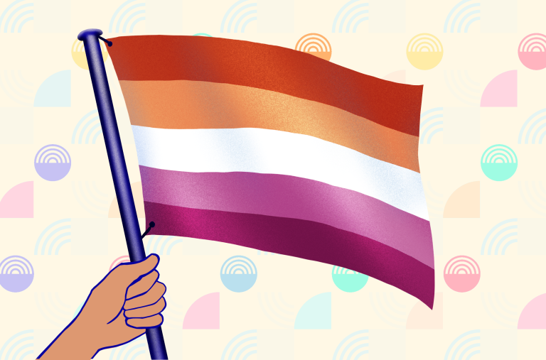

**레즈비언 깃발**

가장 자주 사용되는 레즈비언 깃발인 신 레즈비언 깃발은 Tumblr 블로거인 Emily Gwen에 의해 만들어졌습니다. 이 깃발에는 일곱 줄무늬와 더 단순화된 다섯 줄무늬의 두 가지 버전이 존재합니다. 짙은 주황색은 젠더 비순응을, 주황색은 독립성을, 밝은 주황색은 공동체를, 흰색은 여성성과의 독특한 관계를, 분홍색은 평온과 평화를, 더스티 핑크는 사랑과 성을, 짙은 장미색은 여성성을 상징합니다.

\
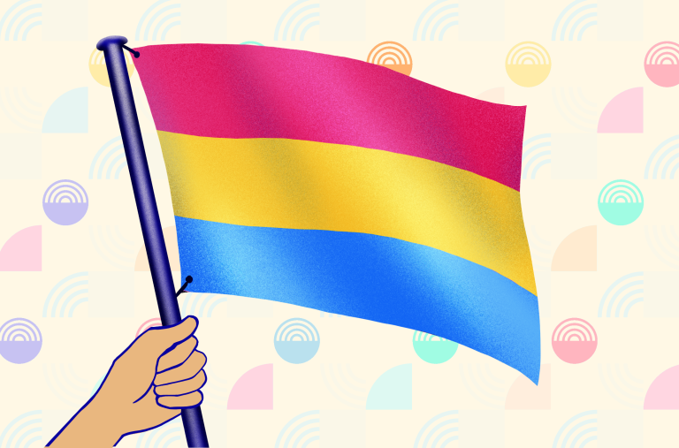

**범성애자 깃발**

2010년에 채택된 범성애자 깃발은 분홍색, 노란색, 청록색의 세 가지 수평 줄무늬로 구성되어 있습니다. 대부분의 정의에 따르면 분홍색과 청록색은 각각 여성과 남성에 대한 매력을 나타내며, 노란색은 논바이너리 젠더에 대한 매력을 상징합니다.

\
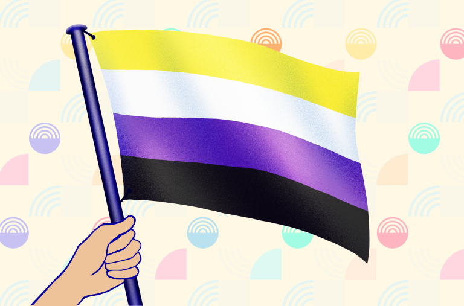

**논바이너리 깃발**

2014년 Kye Rowan에 의해 개념화된 논바이너리 깃발은 노란색, 흰색, 보라색, 검은색의 네 가지 수평 줄무늬로 구성되어 있습니다. 노란색 줄무늬는 스스로의 젠더가 이분법적인 젠더에 존재하지 않는 사람들을 나타냅니다. 흰색과 보라색은 모든 혹은 많은 젠더들로 정체화 하고 스스로의 젠더가 여성과 남성의 혼합이라고 정체화 하는 사람들에 해당됩니다. 마지막으로 검은색 줄무늬는 젠더가 없다고 정체화하는 사람들을 설명합니다.

\
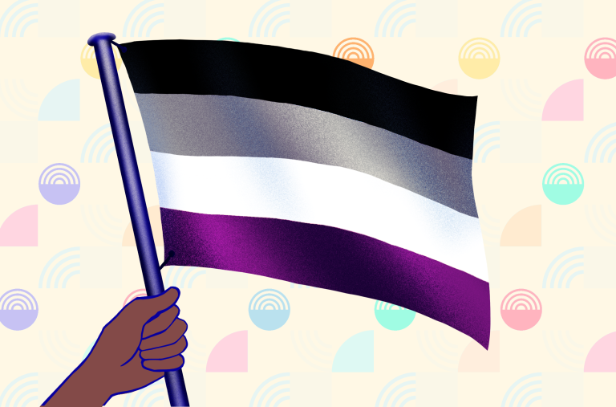

**무성애자 깃발**

2010년 8월 처음 공식적으로 사용된 무성애자 프라이드 깃발은 위에서부터 아래로 검정색, 회색, 흰색, 보라색의 네 가지 수평 줄무늬로 구성되어 있습니다. 검정색은 무성애를, 회색은 섹슈얼리티와 무성애 사이의 회색 영역을 나타냅니다. 흰색 줄무늬는 비성애적 파트너를 의미하며, 보라색 줄무늬는 공동체를 상징합니다.

\
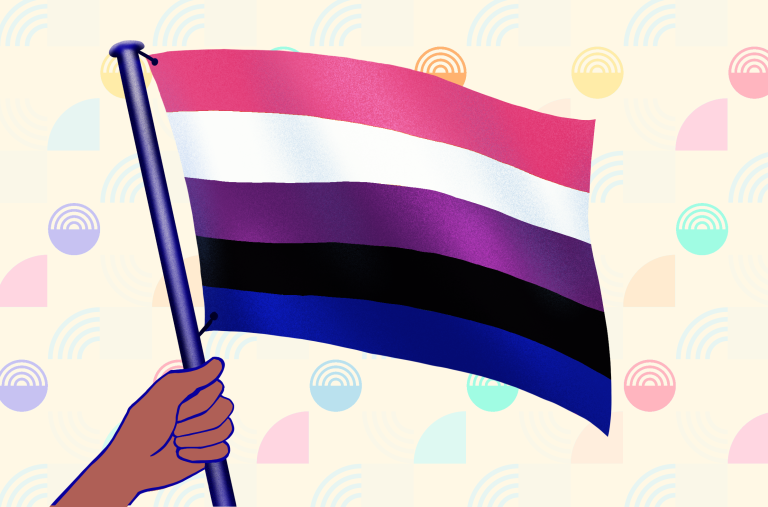

**젠더플루이드 깃발**

젠더플루이드 깃발은 2012년 JJ Poole에 의해 만들어졌으며 다섯 개의 줄무늬를 가지고 있습니다. 이 깃발의 색상 배열에서 분홍색과 파란색은 여성성과 남성성을 나타내고, 보라색은 남성성과 여성성을 모두 포함합니다. 한편, 검은색 줄무늬는 어떤 젠더와도 연결되지 않는 사람들을 상징하며, 흰색 줄무늬는 모든 젠더를 포함합니다.

\
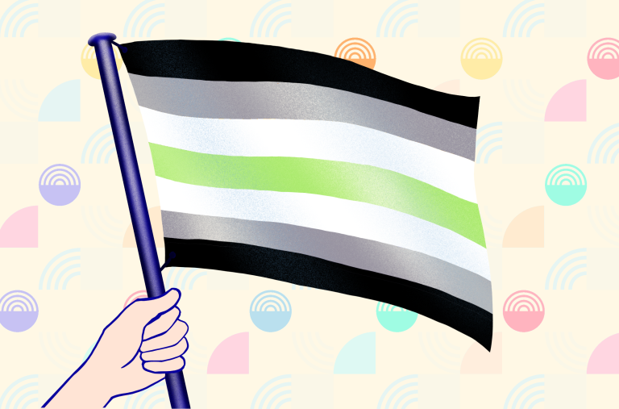

**에이젠더 깃발**

2014년에 공개되고 Salem X에 의해 디자인된 에이젠더 깃발은 일곱 개의 수평 줄무늬로 구성된 대칭 디자인을 가지고 있습니다. 검은색과 흰색 줄무늬는 젠더의 부재를 나타내고, 회색 줄무늬는 반(半)-젠더리스를 나타내며, 중앙의 초록색 줄무늬는 논바이너리 젠더를 상징합니다.

\
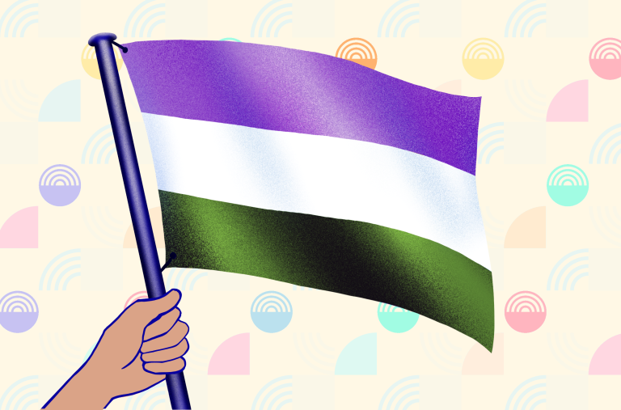

**젠더퀴어 깃발**

젠더퀴어 작가이자 옹호자인 Marilyn Roxie가 2011년에 디자인한 젠더퀴어 깃발은 라벤더색, 흰색, 연초록 줄무늬를 가지고 있습니다. Roxie의 말에 에 따르면, 라벤더색 줄무늬는 전통적으로 남성과 여성을 나타내는 파란색과 분홍색을 혼합한 색으로 안드로지니와 퀴어 정체성을 나타낸다고 합니다. 흰색 줄무늬는 에이젠더 및/또는 젠더 중립적인 정체성을 나타내며, 연초록 줄무늬는 색상환에서 라벤더색의 반대색인데, 제3의 젠더 정체성이과 젠더 이분법 밖의 정체성을 상징합니다.